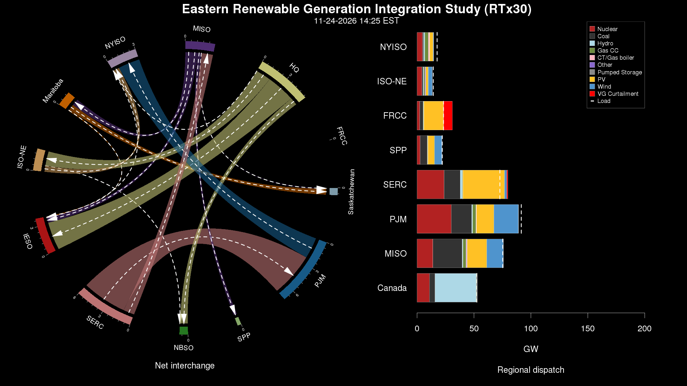
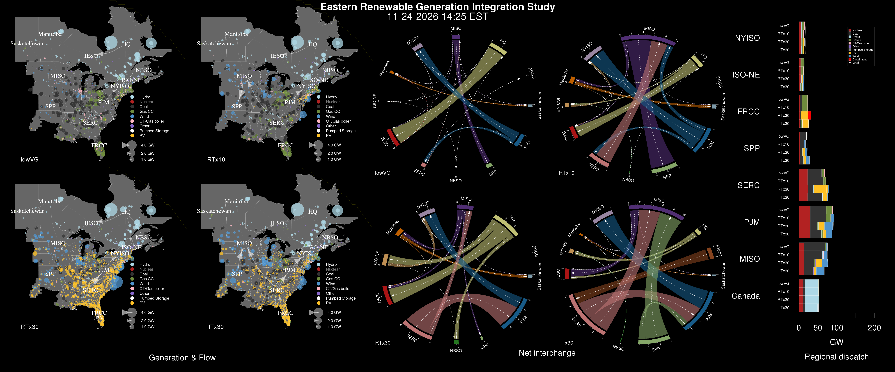

# kaleidoscope

`kaleidoscope` is an R package developed to visualize PLEXOS scenarios. 

### Eastern Renewable Generation Integration Study (ERGIS) Example

Import the dependencies

```
library(devtools)
library(data.table)
library(sp)
library(maptools)
library(NightDay)
library(scales)
library(tidyr)
library(raster)
library(MASS)
library(RColorBrewer)
library(igraph)
library(circlize)
library(dplyr)
library(magrittr)
```
Load the ERGIS time-series data

```
ergis_generation = load_generation('~/ergis/data/final_report/generation_highNetLoad_R30P.csv', 'c_RT_R30P') 
ergis_generation = rbind(ergis_generation, load_generation('~/ergis/data/final_report/generation_highNetLoad_N30P.csv', 'c_RT_N30P'))
ergis_generation = rbind(ergis_generation, load_generation('~/ergis/data/final_report/generation_highNetLoad_SRPS.csv', 'c_RT_SRPS'))
ergis_generation = rbind(ergis_generation, load_generation('~/ergis/data/final_report/generation_highNetLoad_loVG.csv', 'c_RT_loVG'))

load("~/ergis/data/final_report/c_RT_netinterchange.RData") 
c_RT_netinterchange$time = as.POSIXlt(format(c_RT_netinterchange$time, "%Y-%m-%d %H:%M"), tz="EST")
load('~/ergis/data/final_report/c_RT_dispatch_stack_data.RData')
c_RT_dispatch_stack_data$time = as.POSIXlt(format(c_RT_dispatch_stack_data$time, "%Y-%m-%d %H:%M"), tz="EST")
```

Load and/or define static ERGIS data

```
regions=readShapeSpatial('~/data/ergis/regions.shp', proj4string=CRS('+proj=longlat +datum=WGS84 +no_defs +ellps=WGS84 +towgs84=0,0,0'))
ergis_generators = generators=read.csv('~/data/ergis/gen.csv', header=TRUE, sep=',')

centroids = read.csv('~/data/ergis/region-centroids.csv', header=T)
ergis_layout = layout = as.matrix(centroids[,2:3])
ergis_layout = as.matrix(centroids[,2:3])
ergis_verts = sapply(centroids$ISO, toString)

scenarios = data.frame('c_RT_loVG'='lowVG', 'c_RT_SRPS'='RTx10', 'c_RT_R30P'='RTx30', 'c_RT_N30P'='ITx30')
ergis_colors = data.table(type=c("Hydro", "Nuclear", "Coal", "Gas CC", "Wind", "CT/Gas boiler", "Other", "Pumped Storage", "PV", "CHP-QF", "Geothermal", "Storage", "Biomass", "CSP", "Steam", "DR", "RPV"),
                       color=c("#add8e6","#b22222","#333333","#6e8b3d","#4f94cd", "#ffb6c1","#8968cd", "#FFFFFF", "#ffc125", "gray20", "khaki1", "gray45", "mediumpurple2", "darkorange2", "orchid4", "gray60", "goldenrod2"))
ergis_iso = c("Saskatchewan", "PJM", "SPP", "NBSO", "SERC", "IESO", "ISO-NE", "Manitoba", "NYISO", "MISO", "HQ", "FRCC")
```
Plot the ERGIS generation map

```
t = as.POSIXlt("2006-11-24 14:25:00", tz="EST")

draw_density(t, 'None', ergis_generators, ergis_generation, ergis_colors)
draw_generators(t, c("Hydro", "Coal", "Gas CC", "Wind", "CT/Gas boiler", "Other", "Pumped Storage", "PV"), ergis_generators, ergis_generation, ergis_colors, scenario='c_RT_R30P', scaling=0.002)
draw_interchange(t, ergis_verts, ergis_layout, c_RT_netinterchange, c_RT_dispatch_stack_data, 'c_RT_R30P')
```


Or using the ERGIS helper functions, plot the geographic and dispatch views

```
draw_ergis(t)
```


Plot the chord and dispatch views

```
draw_ergis_chord(t)
```


Plot an Insight Center frame

```
draw_ergis_comparative_insight(t)
```
